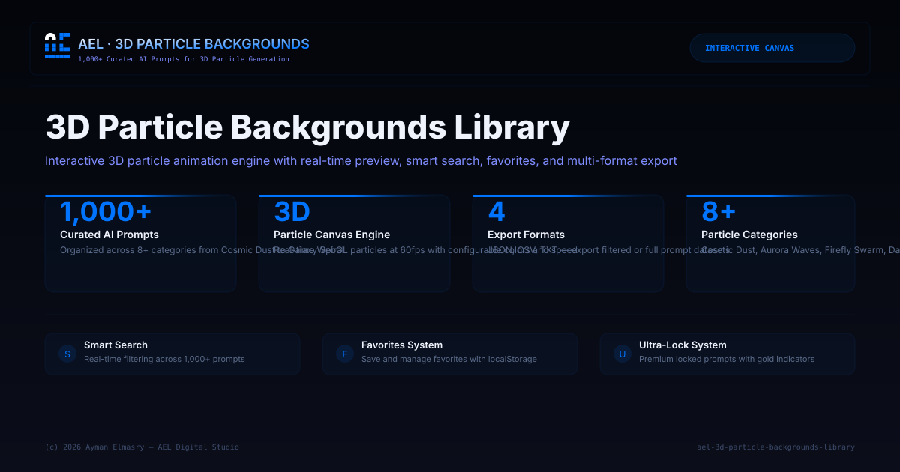

# Professional 3D Particle Backgrounds Library

  

**A professional 3D particle backgrounds library** with 1000+ curated AI prompts for Midjourney, Stable Diffusion, DALL-E and more.

## Features

- **1000+ Prompts**: Curated prompts for 3D particle background generation
- **Smart Search**: Real-time filtering across all prompts by keyword
- **Particle Canvas**: Interactive 3D particle background animation
- **Favorites System**: Save and manage favorite prompts
- **One-Click Copy**: Copy any prompt to clipboard
- **Dark Theme**: Premium glassmorphism UI with blue (#0074FF) accents
- **Export**: Download prompts in multiple formats

## Tech Stack

- **HTML5** — Semantic structure
- **CSS3** — Glassmorphism, flexbox, grid, custom properties
- **JavaScript** — Search engine, favorites, particle animation engine
- **Deployment**: GitHub Pages

## Author

**Ayman Elmasry** — AEL Digital Studio

---

_© 2026 AEL Digital Studio. All rights reserved._
